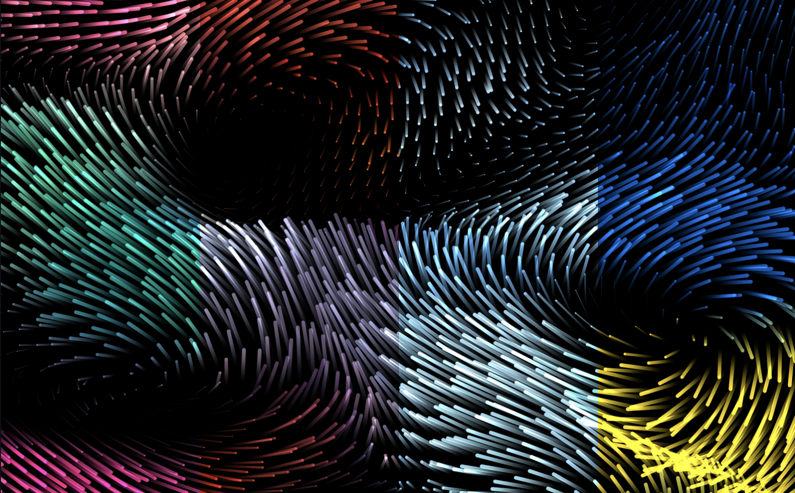

# Drift_2.0 Screensaver for macOS

A fluid simulation screensaver for macOS, this repo helps install Drift as a native macOS bundle with a one-command installer.

This also fixes the bug on newer macOS versions where Drift only displays on the primary monitor when using multiple displays.

Built on [Flux](https://github.com/sandydoo/flux) by [Sander Melnikov](https://github.com/sandydoo)



## Install

Requires macOS. The installer will prompt you if Xcode Command Line Tools are needed.

### Steps

1. Open the **Terminal** app (search "Terminal" in Spotlight)
2. Copy and paste this into Terminal, then press Enter:

```sh
git clone https://github.com/yanzhehw/Drift_V2.git && cd Drift_V2 && ./install.sh
```

Then this new screensaver will appear in Screen Saver library, select **Drift_V2**

To summarize, the installer will:

1. Install Rust temporarily if not already present
2. Build the screensaver from source (~2 min)
3. Install to `~/Library/Screen Savers/`
4. Clean up all build artifacts and Rust (if it wasn't installed before)

The final installed bundle is ~5 MB.

## Color Schemes

Open **System Settings > Screen Saver**, select **Drift_V2**, then click **Options** to choose:

| Preset | Description |
|--------|-------------|
| Original | Classic Drift-style procedural colors |
| Plasma | Warm purples and oranges |
| Poolside | Cool aquatic blues |
| Gumdrop | Candy-colored pastels |
| Silver | Monochrome metallic |
| Freedom | Red, white, and blue |

## Uninstall

```sh
rm -rf ~/Library/Screen\ Savers/Drift_V2.saver
```

## Credits

The Flux engine is created by [Sander Melnikov (sandydoo)](https://github.com/sandydoo/flux) and released under the MIT license. This repo adds the macOS screensaver wrapper and installer.


## License

[MIT](LICENSE)
